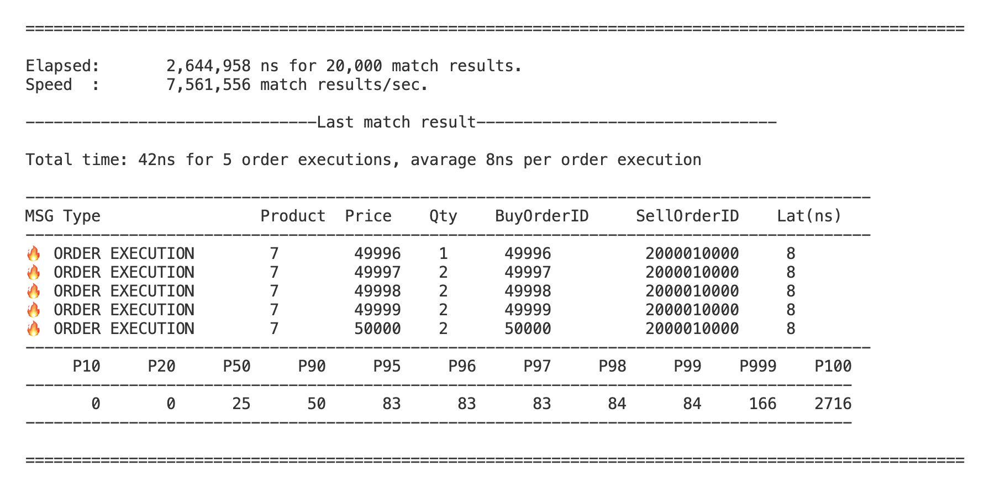

# 🔥 Lighting Match Engine Core 🔥

**Built with Rust for Blazing-Fast Performance**

[](https://opensource.org/licenses/MIT)
[](https://www.rust-lang.org/)
[](https://travis-ci.com/philipgreat/lighting-match-engine-core)

The Lighting Match Engine Core is a minimal, lighting-fast matching engine designed for a single purpose: **matching orders with extreme speed and reliability**.

It's a focused, no-frills engine that you can build upon. Each instance serves a single product, making it highly efficient and scalable.

## 🚀 Why Choose Lighting Match Engine Core?

*   **⚡️ Blazing Fast:** Written in Rust, it's designed for performance. We're talking nanosecond-level precision.
*   **💪 Lean Runtime:** The current repo keeps dependencies minimal and focuses on in-memory matching logic, order-book structures, and benchmarking utilities.
*   **💡 Simple & Focused:** It does one thing and does it well: matching. No unnecessary features, no bloat.
*   **🌐 Universal:** Use it for a wide range of products:
    *   Stocks & Cryptocurrencies
    *   Futures & Options
    *   Forex & Commodities
    *   NFTs & Real Estate
    *   ...and much more!

## ✨ Key Features

*   **Two In-Memory Books:** Choose between `dense` and `sparse` order book implementations at startup.
*   **Continuous Matching:** Buy and sell orders are matched in memory with price/time priority behavior in the order book implementations.
*   **Call Auctions:** Opening and optional closing auction flows are implemented through `SessionRunner` and `CallAuctionPool`.
*   **Order Price Modes:** Shared order types support both market and limit price modes; call auction entry currently accepts limit orders only.
*   **Wire Codec:** Submit, cancel, trade, stats, and reject messages are encoded into fixed 64-byte packets.
*   **Built-In Benchmarks:** `match-timing` latency measurement and call-auction benchmark paths are included in the executable and stats modules.
*   **Configurable Runtime:** CLI flags control product ID, instance name, test book size, book type, tick, base price, max levels, and trade cap.
*   **CPU Affinity Support:** The runtime can pin the matching thread to a CPU core via the cross-platform `cpu_affinity` module.

## 📄 Project Summary

*   One-page PDF summary: [lighting-match-engine-core-summary.pdf](/Users/Philip/githome/lighting-match-engine-core/output/pdf/lighting-match-engine-core-summary.pdf)

## 🛠️ Quick Start

Get up and running in minutes!

1.  **Start the Engine:**

    ```bash
    make
    ```

    or

    ```bash
    cargo run --features match-timing --release -- --prodid 7 --name AAPL --test-order-book-size 50k
    ```

    This command starts a demo/benchmark run for product `7` with instance tag `AAPL` and seeds a test order book with `50k` bids and `50k` asks.

2.  **See the Magic:**

  You'll see a match result like this:



  That's an internal match time(core-matching latency) of just **8 nanoseconds** per order execution with 50K asks and bids respectively on An Apple M1 Max Macbook Pro.

  Code snippet in main.rs
  
```rust
    let start = timer.ns() as u64;
    
    
    for i in 0..count {

        let  new_order_buy = Order{
            product_id: 7 ,
            order_type: ORDER_TYPE_BUY,
            price:100000000000,
            price_type: ORDER_PRICE_TYPE_LIMIT,
            quantity:5,
            order_id: 1_000_000_000+i,
            submit_time:100,
            expire_time:0,
            

        };
        
        engine_state.match_order(new_order_buy);

        let new_order_sell = Order{
            product_id: 7 ,
            order_type: ORDER_TYPE_SELL,
            price:1,
            price_type: ORDER_PRICE_TYPE_LIMIT,
            quantity:9,
            order_id: 2_000_000_000+i+1,
            submit_time:2_000_000_000+i+1,
            expire_time:0,

        };
        engine_state.match_order(new_order_sell);

    }
    let end = timer.ns() as u64;
    println!("Time consumed {} ns for {} match request.", (end-start),2*count);
    println!("Speed: {} match results per second.", ( (1_000_000_000)*(2*count ) ) /(end-start));

```


## ⚙️ How It Works

The engine follows a simple, robust workflow:

1.  **Parse Config:** `config::get_config()` reads CLI flags and selected environment variables into `AppConfig`.
2.  **Build Order Book:** `orderbook::factory::build_order_book()` creates either a dense or sparse in-memory book.
3.  **Run Demo Session:** `system::run_demo_session()` drives opening auction, continuous trading, and optional closing auction transitions through `EngineState`.
4.  **Seed and Benchmark:** `main.rs` seeds a sample book, submits benchmark orders, measures match latency, and prints stats tables/results.
5.  **Serialize Messages:** `protocol::codec` can encode submit/cancel/trade/stats/error packets; live socket I/O is not implemented in this repo snapshot.

## 🧩 What's in the Box (and What's Not)

This engine is the core of a trading system. You'll need to build the surrounding systems to create a complete solution.

**In Scope:**

*   A simple, robust, and fast matching engine.

**Out of Scope:**

*   Product Management System
*   Market Data System
*   Order Management System (OMS)
*   Risk Management System
*   ...and other external systems.

## 📚 Architecture Docs

The current matching-core boundaries, market terms, and session concepts are documented here:

*   [Market Terms And Configuration](/Users/Philip/githome/lighting-match-engine-core/docs/market-terms-and-configuration.md)
*   [Case Handling Guide](/Users/Philip/githome/lighting-match-engine-core/docs/case-handling-guide.md)

## 🤝 Contributing

We welcome contributions from the community! Whether you want to fix a bug, add a feature, or improve the documentation, we'd love to have your help.

## 📜 License

This project is licensed under the [MIT License](./LICENSE.md).

## 💬 Contact

Have questions or want to get involved?

*   **Telegram:** <https://t.me/philip_is_online>
