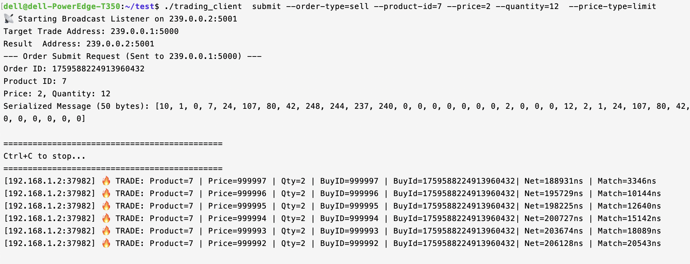

# 🔥 Lighting Match Engine Core 🔥

**Built with Rust for Blazing-Fast Performance**

[](https://opensource.org/licenses/MIT)
[](https://www.rust-lang.org/)
[](https://travis-ci.com/philipgreat/lighting-match-engine-core)

The Lighting Match Engine Core is a minimal, lighting-fast matching engine designed for a single purpose: **matching orders with extreme speed and reliability**.

It's a focused, no-frills engine that you can build upon. Each instance serves a single product, making it highly efficient and scalable.

## 🚀 Why Choose Lighting Match Engine Core?

*   **⚡️ Blazing Fast:** Written in Rust, it's designed for performance. We're talking nanosecond-level precision.
*   **💪 Reliable:** With minimal dependencies (only Tokio for networking), the engine is incredibly stable.
*   **💡 Simple & Focused:** It does one thing and does it well: matching. No unnecessary features, no bloat.
*   **🌐 Universal:** Use it for a wide range of products:
    *   Stocks & Cryptocurrencies
    *   Futures & Options
    *   Forex & Commodities
    *   NFTs & Real Estate
    *   ...and much more!

## ✨ Key Features

*   **Order Types:** Market and Limit orders.
*   **Matching Policies:** Price-first, time-first.
*   **High Precision:** Time is measured in nanoseconds.
*   **Lean & Mean:** 64-byte package size for efficient network communication.
*   **In-Memory Processing:** All operations happen in memory for maximum speed.
*   **UDP Multicast:** Orders are received via UDP multicast for low-latency communication.

## 🛠️ Quick Start

Get up and running in minutes!

1.  **Start the Engine:**

    ```bash
    make
    ```

    or

    ```bash
    cargo run --release -- --prodid 7 --tag FIX009 --test-order-book-size 10k
    ```

    This command starts an engine instance for product `7` with the tag `FIX009` and a test order book of 10,000 buy and sell orders.

2.  **See the Magic:**

  You'll see a match result like this:



  That's an internal match time(core-matching latency) of just **46 nanoseconds** per execution with 10K asks and bids respectively on An Apple M1 Max Macbook Pro.

  Code snippet in main.rs
  
```rust
    let start = timer.ns() as u64;
    
    
    for i in 0..count {

        let  new_order_buy = Order{
            product_id: 7 ,
            order_type: ORDER_TYPE_BUY,
            price:100000000000,
            price_type: ORDER_PRICE_TYPE_LIMIT,
            quantity:5,
            order_id: 1_000_000_000+i,
            submit_time:100,
            expire_time:0,

        };
        
        engine_state.match_order(new_order_buy);

        let new_order_sell = Order{
            product_id: 7 ,
            order_type: ORDER_TYPE_SELL,
            price:1,
            price_type: ORDER_PRICE_TYPE_LIMIT,
            quantity:9,
            order_id: 2_000_000_000+i+1,
            submit_time:2_000_000_000+i+1,
            expire_time:0,

        };
        engine_state.match_order(new_order_sell);

    }
    let end = timer.ns() as u64;
    println!("Time consumed {} ns for {} match request.", (end-start),2*count);
    println!("Speed: {} match results per second.", ( (1_000_000_000)*(2*count ) ) /(end-start));

```


## ⚙️ How It Works

The engine follows a simple, robust workflow:

1.  **Rebuild Order Book:** The order book is rebuilt from an order book fuel server (not included in this project).
2.  **Receive Orders:** The engine listens for incoming order requests via UDP.
3.  **Match Orders:** The core matching logic is executed.
4.  **Broadcast Results:** Matching results are broadcast to the network.

## 🧩 What's in the Box (and What's Not)

This engine is the core of a trading system. You'll need to build the surrounding systems to create a complete solution.

**In Scope:**

*   A simple, robust, and fast matching engine.

**Out of Scope:**

*   Product Management System
*   Market Data System
*   Order Management System (OMS)
*   Risk Management System
*   ...and other external systems.

## 🤝 Contributing

We welcome contributions from the community! Whether you want to fix a bug, add a feature, or improve the documentation, we'd love to have your help.

## 📜 License

This project is licensed under the [MIT License](./LICENSE.md).

## 💬 Contact

Have questions or want to get involved?

*   **Telegram:** <https://t.me/philip_is_online>
